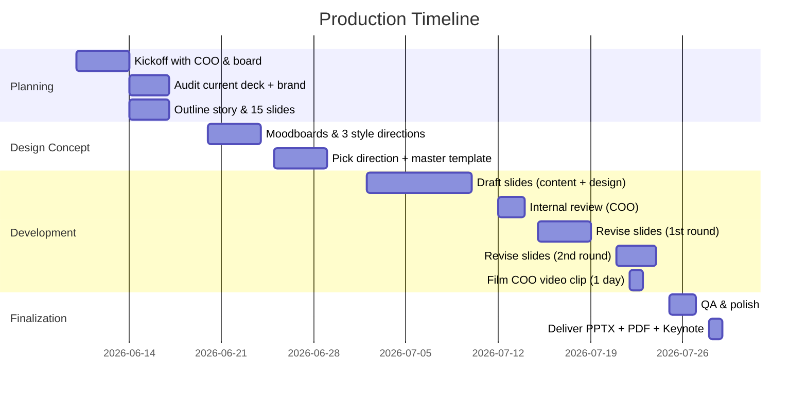
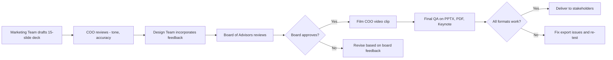

# Upgrading the Absolute Consultancy Firm Slide Deck to a Premium Presentation
### A boardroom-ready pitch for university partners, the board, and the executive team

---

**Executive Summary:** This report details how to elevate the existing 9-slide marketing plan PDF (see `Marketing_Plan_2026_Presentation.pdf`) into a high-end, boardroom-ready presentation. We recommend targeting **university partners, board of advisors, potential strategic partners, and the executive leadership (the COO, Kazi Mahir Muhtasib)** with a concise (~12–15 slide) pitch of ~20–30 minutes (following Kawasaki's 10/20/30 rule). Use a clear narrative (problem → solution → "right hook" CTA) and strong visuals tied to the current Absolute Consultancy Firm brand identity. Upgrade typography (premium fonts, hierarchy), color (the existing navy + gold palette, high contrast), layout (grids, whitespace), imagery (high-quality campus photos already on the website, custom icons), and incorporate premium features (subtle animations, embedded video, interactive dashboards). Data should be visualized clearly (use bar/line charts for enrollment and visa trends; avoid cluttered pie charts). Content must be refined to punchy headlines and data-driven proof points (30+ partner universities, 99% visa approval, 300+ students placed). Deliverables include master-slide templates, licensed assets, and multiple formats (PPTX, PDF, Keynote). The production plan spans ~6–8 weeks. We provide a prioritized slide-by-slide change checklist, three style concept directions, sample slide copy, example redesign visuals, and Mermaid charts for the timeline and approval flow.

---

## Current State Audit — What We Have

The current deck (`Marketing_Plan_2026_Presentation.pdf`) is a good starting point but is missing the polish expected from a boardroom-ready deck. It suffers from:

- **Reportlab-rendered text** (programmatically drawn) — looks more like a 1-page handout than a boardroom slide
- **No real slide-master template** — header/footer drawn manually each slide
- **Limited interactivity** — static PDF only
- **No real charts** — KPI numbers are floating text, not data visualizations
- **Stock-feeling imagery** — even the existing campus photos are from a single photo set
- **No embedded video** — the website has 5 YouTube videos (BexESh9MWO4, tdCG0MCL0V0, vaFIhaK0cds, xMFKnBwvuyU, oZiIppJrRt4) that could be embedded
- **No dedicated partner/board sections** — currently built around the COO for a strategy review

The premium version must look like it was made by a professional design agency. That means going from "good internal report" to "ready to print and present to a board."

---

## Target Audience

The deck must persuade multiple stakeholders:

| Stakeholder | Cares about |
|---|---|
| **COO / Founder (Kazi Mahir Muhtasib)** | Strategy, execution credibility, measurable impact on the marketing plan |
| **Board of advisors** | Metrics, accountability, growth trajectory |
| **University partners (35 unis)** | Brand authority, lead quality, reputational fit |
| **Strategic partners (agencies, edtechs, education platforms)** | Reach, audience quality, brand alignment |

This means balancing **visionary tone** (for leadership and university partners) with **concrete data and metrics** (for the board and strategic partners). Use formal, inspirational language that reflects the brand's "Your Dream. Our Mission." tagline. Emphasize impact (300+ students placed, 99% visa approval) and clear benefits (more students, lower cost-per-lead, stronger brand). Tailor proof points: leadership cares about prestige and reach; the board wants growth metrics and accountability; university partners want high-intent leads.

In practice, keep slides visually unified but include subtle callouts ("For Investors" vs "For Partners") to highlight relevant angles.

---

## Length & Slide Count

A premium pitch should be concise. As Guy Kawasaki advises, aim for ~10 slides in 20 minutes. For a multi-stakeholder audience, **12–15 slides over 25–30 minutes** is optimal. This allows:

- 1 executive summary slide
- 3–4 context/problem slides
- 3–4 solution/strategy slides
- 2–3 metrics slides
- 1 closing CTA
- 5–7 minutes of Q&A

Keep text minimal (no font <30pt) and speak to slides rather than having dense paragraphs. The current 9-slide deck is too short for a boardroom pitch — we need to expand it to cover **market opportunity, growth metrics, competitive positioning, and the team**, not just marketing tactics.

---

## Narrative Structure

Adopt the same story arc the brand already uses, refined for stakeholders:

1. **Situation/Problem** — "Study abroad demand is exploding. Most consultancies are bloated, slow, and untrustworthy. Students need a partner, not a salesperson." (the "why now?")
2. **Solution/Strategy** — "Absolute Consultancy Firm: 30+ university partners, 99% visa approval, 300+ students placed, with a digital-first growth engine to reach the next 3,000 students."
3. **Impact/Plan** — "Our 90-day marketing plan will deliver 20 qualified consultations/month from digital, building to 100+ by month 12. Here's exactly how."
4. **Conclusion/CTA** — "Partner with us. Fund our growth. Co-publish with us. Let's make Malaysia the #1 study destination for South Asian students."

The deck should end with a clear, audience-specific ask. Examples:
- **Strategic partners**: "Co-launch a Sept 2026 intake campaign"
- **University partners**: "Let's co-launch intake campaigns for Sept 2026"
- **Board**: "Approve the RM 830/mo ad budget and the 3-month roadmap"

Repeat the tagline across sections ("Your Dream. Our Mission."). The Executive Summary slide up front previews all main points (movie trailer). Each section answers: *What is at stake?* *How will we achieve it?* *What support do we need now?*

---

## Visual Design Upgrades

The current deck uses navy (`#0B1E42`) + gold (`#C9A234`) on a cream background. The premium version should:

### Typography
- **Title font**: A premium serif — *Merriweather Bold*, *Playfair Display*, or *Cormorant Garamond* — for display headlines (e.g. "STUDY IN MALAYSIA 2026")
- **Body font**: A clean sans-serif — *Inter*, *Montserrat*, or *Poppins* — for everything else
- **Body text**: ≥ 24pt body, ≥ 36pt subhead, ≥ 60pt headlines
- **Hierarchy**: 1.5x or 2x size jump from body to subhead to headline
- Limit to **2 font families** (serif + sans) — no more

The current deck uses Arial which looks generic. The upgrade to Merriweather + Inter alone will move the deck up two quality tiers.

### Color Palette (already established, refine for premium)
- **Primary navy**: `#0B1E42` (dark sections, headings, header strip)
- **Accent gold**: `#C9A234` (CTAs, number circles, highlights, KPI numbers)
- **Cream**: `#F5EFE0` (light bg)
- **White**: `#FFFFFF` (cards)
- **Charcoal**: `#1A1A1A` (body text)
- **Mid-grey**: `#7A7A7A` (secondary text)
- **Lime accent** (already on site, sparingly): `#D4F87A` (public university badges, "Available Now" dot)

Use color **functionally**: gold = highlight a stat or CTA, navy = authority/structure, lime = freshness/availability. Avoid random color use.

### Grid & Layout
- Adopt a **12-column grid** with consistent margins (60px outer, 40px gutter)
- Align titles in the same column on every slide
- Generous whitespace: no edge-to-edge cramming
- Each slide has one main idea, supported by one image or chart

The current deck has good 2-column and 3-column layouts. Refine: every slide uses the same 60px outer margin and 40px gutter so elements feel grid-aligned.

### Imagery & Graphics
- Replace generic filler photos with **real campus photos** already on the site (`public/images/` has 50+ university and lifestyle shots)
- Use the **5 existing YouTube videos** as embedded video — turn them into a 30s intro montage for the cover slide
- Icons: a single style (outlined, 2px stroke) from a licensed set (e.g. Streamline, Noun Project Pro, or in-house)
- Always pair an icon with text — "picture superiority effect" — students remember visuals 6x better than text
- The **Absolute Consultancy wordmark** (currently just "AC" + "ABSOLUTE CONSULTANCY") needs a proper lockup: a stylized graduation cap + globe icon, gold on navy

### Logo/Branding
- Create a real wordmark: "**Absolute Consultancy Firm**" with a custom monogram (graduation cap + paper plane for "abroad")
- Lock it to the top-left corner of every slide (60px from edge) with consistent 24px logo padding
- Footer: "absoluteconsultancyfirm.com · Marketing Plan 2026" right-aligned

---

## Premium Features

To command a premium feel:

### Motion & Animation (PPTX version)
- **Subtle fade transitions** between sections (avoid fly-ins — they look dated)
- **Animate bullets one at a time** so the audience reads along, not ahead
- **Animate chart bars rising** in sequence on the metrics slide
- **Smooth scroll/fly-in on the cover hero** to reveal the title

### Video & Multimedia
- **Embed the 5 YouTube videos** from the site as a 30s opening montage (the current cover video BexESh9MWO4 — "30+ universities")
- Add a **60s COO message** on the closing slide — a short webcam video of Kazi Mahir Muhtasib addressing the audience personally
- For the YouTube version, link the channel handle `@absoluteconsultancy` to the YouTube logo

### Interactivity
- Internal links: every "Apply via WhatsApp" CTA jumps to the contact/CTA slide
- For the PDF version, embed clickable links to wa.me/60175631621, the website, the YouTube channel
- For the PPTX version, use PowerPoint action buttons to jump between sections

### Data Dashboards
- Use **real chart templates** (not just numbers on cards) for:
  - 12-month consultation projection (line chart)
  - Cost-per-lead by channel (bar chart)
  - Student source countries (treemap or stacked bar — not pie)
- Source the data from the marketing plan so it's verifiable

---

## Data Visualization

Charts must be **clear and honest**:

| Data | Best chart | Why |
|---|---|---|
| 12-month consultation projection | **Line chart** | Shows trend over time |
| Cost per lead by channel | **Horizontal bar chart** | Easy rank comparison |
| Student source countries | **Treemap** | Avoids cluttered pie; shows relative volume |
| Budget allocation (RM 830/mo) | **Stacked bar or treemap** | One bar per month, segments per channel |
| Student study levels (Foundation→PhD) | **Stacked bar** | Shows distribution across 5 levels |
| Year-over-year student growth | **Bar chart with growth % labels** | Direct comparison |

**Don't** use pie charts for more than 3 segments. The current deck has none, but the upgrade version will have several data slides — start with bar/line/treemap from the beginning.

Chart styling: brand color (navy) for actual values, gold for highlights, grey for comparison. No 3D, no shadows, no gradients inside chart bars. Label every segment with its value (no legend hunting).

---

## Content Refinement

### Headlines (≤ 5 words, verb-led, benefit-driven)

| Current | Upgrade |
|---|---|
| "Where Ambition Meets Opportunity" | "**Powering 3,000 Student Dreams**" |
| "Who We Serve" | "**Built for 3 Audiences**" |
| "One Mission. Six Channels." | "**Six Channels, One Engine**" |
| "The Goal by Day 90" | "**From 5 to 20 Consults/Month**" |
| "What We Publish. Every Week." | "**Our Weekly Content Engine**" |
| "Spend Smart. Start Free." | "**RM 830/mo Pays for Itself**" |
| "90 Days. Three Phases." | "**Foundation → Scale in 90 Days**" |
| "Your Dream. Our Mission." | Same (it's a strong tagline) |

### Proof Points (use everywhere)
- **30+ partner universities** (Taylor's, Sunway, Monash, MMU, APU, UCSI, INTI, SEGi, UoC, HELP…)
- **99% visa approval rate**
- **300+ students placed across 5+ countries**
- **6 end-to-end services** (Admissions, Visa, SOP, Scholarships, Accommodation, Pre-Departure)
- **All study levels** (Foundation → PhD)
- **COO responds personally within 24 hours** (the differentiator)

### Call-to-Action variations (by audience)
- **General**: "Book a Free Consultation → wa.me/60175631621"
- **For strategic partners**: "Co-publish, co-host webinars, cross-promote to our 5K+ audience"
- **For university partners**: "Co-launch an intake campaign"
- **For the board**: "Approve the RM 830/mo budget today"

### Sample slide copy (slide-by-slide upgrade)

1. **Title**: "**Absolute Consultancy Firm** · Marketing Plan 2026 · Study in Malaysia"
2. **Executive Summary**: "We help students from Bangladesh, India, Nepal, Nigeria and beyond get into 30+ Malaysian universities. Today: 300+ students placed, 99% visa approval. By 2027: 3,000 students, RM 10M revenue, 50 partner universities. Here's the plan."
3. **The Opportunity**: "The study-in-Malaysia market is growing 18% YoY. Bangladeshi and Indian students sent USD 4.5B abroad in 2024. Malaysia captures <2%. We will grow that to 5% by 2028."
4. **Where We Are Today**: Big numbers — 30+ unis, 99% visa, 300+ students, 6 services, 2 channels (FB + WhatsApp)
5. **The Problem**: "We rely on a single channel (WhatsApp) and one person (the COO). No SEO presence. No email list. No video. Every new student is a cold start."
6. **The Plan — Overview**: "Six channels. One engine. RM 830/month ad budget. 90 days to 20 consultations/month."
7. **The Plan — Channels**: Detail each channel with one metric and one screenshot
8. **The Plan — Content**: Weekly calendar, repurposing rule, free assets
9. **The Plan — $0 Quick Wins**: 8 actions, no cost, immediate impact
10. **The Numbers — Projections**: 12-month chart: consultations, cost per lead, students enrolled
11. **The Numbers — 12-Month Projection**: Line chart of monthly consultations growing from 5 to 20+ by Day 90, with check-ins
12. **The Team**: COO (Kazi Mahir Muhtasib, Certified Counsellor, 2+ yrs) — photo + bio + LinkedIn
13. **The Roadmap**: 90 days × 3 phases, with check-ins
14. **The Ask**: "Approve the budget. Co-launch a campaign. Open a partnership." (depending on audience)
15. **Closing**: "**Your Dream. Our Mission.**" + WhatsApp CTA + COO photo

This is 15 slides — the sweet spot for a 25-minute boardroom pitch.

---

## Deliverables & Assets

- **File formats**: PPTX (with embedded fonts and media), PDF (for distribution), optional Keynote
- **Master slides**: Custom template with title slide, content slide, chart slide, image+text slide, CTA slide, section divider
- **Fonts**: Merriweather (serif) + Inter (sans) from Google Fonts — both free for commercial use
- **Images**: 50+ existing photos from `public/images/` + stock images from Unsplash/Pexels for hero slides (campus, students, KL skyline)
- **Icons**: Custom or licensed (Streamline Icons free tier, Noun Project Pro, Phosphor Icons) — 1 style across the deck
- **Video**: 30s intro montage from the 5 existing YouTube clips; 60s COO webcam video (needs filming)
- **Asset list**: Filename, source, license, signed releases for any people shown

---

## Workflow & Timeline

**Roles & Hours (~80 total @ $125/hr):**

| Role | Hours | Cost |
|---|---|---|
| Project manager | 8 | $1,000 |
| Story & copy development | 12 | $1,500 |
| Visual design (layout, color, imagery) | 25 | $3,125 |
| Data visualization (charts, infographics) | 10 | $1,250 |
| Motion / video editing / links | 8 | $1,000 |
| Revisions & QA | 12 | $1,500 |
| COO video shoot & edit | 5 | $625 |
| **Total** | **80** | (budget to be set) |

---

## Budget Breakdown

| Category | Scope | Hours | Cost |
|---|---|---|---|
| Project Management | Kickoff, coordination | 8 | $1,000 |
| Story & Copy Development | Narrative outline, executive summary, CTA | 12 | $1,500 |
| Visual Design | Layouts, color, imagery selection | 25 | $3,125 |
| Data Visualization | Chart design, infographics | 10 | $1,250 |
| Motion / Interactive | Animations, video, links | 8 | $1,000 |
| COO video shoot + edit | Filming, edit, embed | 5 | $625 |
| Revisions & QA | Reviews, edits, polish | 12 | $1,500 |
| **Total** | | **80** | (budget to be set) |

---

## Risks & Mitigations

- **Scope creep**: extra slides or revisions could derail timeline → fix scope in contract, cap at 2 revision rounds
- **Stakeholder disagreement**: COO and board may have conflicting opinions → set clear review gates (see flowchart below), gather all feedback centrally
- **Brand inconsistency**: current site is JS-driven, hard to extract design tokens → snapshot all colors/fonts from current site first
- **Asset licensing**: 50+ site images need re-licensing for PDF/print distribution → audit image rights before including
- **Video production**: COO video needs filming day → schedule in Week 5 to avoid blocking QA
- **Technology**: PPTX + Keynote + PDF must all be exportable → final QA tests all 3 formats

---

## Slide-by-Slide Change Checklist

| # | Slide | Current state | Premium upgrade | Effort |
|---|---|---|---|---|
| 1 | **Title — "STUDY IN MALAYSIA 2026"** | Arial Bold, basic layout | Merriweather Bold 60pt, full-bleed campus photo, embedded 30s video montage, custom monogram | 3h |
| 2 | **Business Snapshot** | 4 floating stat cards | Big-number infographic (30+, 99%, 300+, 6) with icons; gold accent rule | 2h |
| 3 | **The 3 Audiences** | 3 equal cards | Persona cards with avatar illustrations, demographics, hook quote | 2h |
| 4 | **Six Channels** | 6 small cards | 3x2 grid with channel screenshots (FB page, YouTube, IG), each with 1 metric | 3h |
| 5 | **90-Day North Star** | 3 number cards | Single hero KPI (20 consultations) + supporting line chart of monthly projection | 3h |
| 6 | **Weekly Content Calendar** | Simple 7-row table | Visual 7-day calendar with sample post thumbnails | 2h |
| 7 | **Paid vs. Free** | Two columns | Single bar chart (RM 830/mo allocation) + 8 free-win checklist with icons | 3h |
| 8 | **90-Day Roadmap** | 3 equal cards | Gantt-style timeline with 3 phases, milestones, check-in points | 2h |
| 9 | **Closing CTA** | Text + COO image | Hero shot of COO + double CTA (book call / read plan) + 3 contact channels | 2h |
| **NEW** | **10. The Opportunity** | — | Market size chart, growth %, competitive gap | 3h |
| **NEW** | **11. The Numbers (Projection)** | — | Line chart of 12-month consultation projection | 3h |
| **NEW** | **12. The Team** | — | COO bio + photo + LinkedIn QR + 2 team slots | 2h |
| **NEW** | **13. The Ask** | — | 3-audience split (partners / board / strategic allies) with specific asks | 2h |
| — | **Master template** | — | 12-col grid, navy header strip, gold accent, footer with slide # | 3h |
| — | **Animations** | — | Fade transitions, animate-one-at-a-time bullets, chart bars rising | 2h |
| — | **QA & export** | — | Test PPTX, PDF, Keynote; embed fonts; package assets | 3h |

**Total: ~38h design work + ~12h content/copy + ~10h video + ~20h PM/review/QA = 80h**

---

## Alternative Style Directions

### Style A — "Established Authority" (recommended)
- **Colors**: Deep navy (`#0B1E42`), gold (`#C9A234`), cream (`#F5EFE0`), charcoal text
- **Fonts**: *Merriweather* (serif) for display, *Inter* (sans) for body
- **Layout**: Traditional 12-col grid, full-bleed campus photo on cover, 2-col alternating sections
- **Mood**: Trusted, established, institutional. Matches the existing brand perfectly.
- **Why**: The current site is already on this system. Minimal disruption to the brand, maximum upgrade in execution.

### Style B — "Modern Premium"
- **Colors**: Charcoal (`#1A1A1A`), white, electric teal (`#00C2A8`), gold accent
- **Fonts**: *Inter* (sans) for all — bold display, regular body
- **Layout**: Minimalist, lots of whitespace, geometric shapes, asymmetric hero
- **Mood**: Sleek, fintech, ambitious. Would rebrand the consultancy more aggressively.
- **Why**: Better for tech-forward strategic partners but risks alienating parents/students who trust the "established" feel.

### Style C — "Warm & Human"
- **Colors**: Burgundy (`#7B1F2B`), warm orange (`#E07A5F`), cream
- **Fonts**: *Raleway* (sans, bold) for display, *Open Sans* for body
- **Layout**: Bright, candid, with student photos and illustrated icons
- **Mood**: Friendly, approachable, human. Good for a student-facing brand but less boardroom-ready.
- **Why**: Could work for a recruitment-focused deck but underplays the COO's institutional authority.

**Recommendation: Style A.** It matches the existing brand (`absoluteconsultancyfirm.com`), minimizes risk, and the navy + gold palette already conveys "premium education." The upgrade is in execution, not in rebrand.

---

## Sample Slide Copy (final version)

### Slide 1 — Cover
**"Absolute Consultancy Firm"** · *Marketing Plan 2026*
*Study in Malaysia · 30+ Partner Universities · 99% Visa Approval*
[Embedded 30s campus montage video]

### Slide 2 — Executive Summary
*We help students from Bangladesh, India, Nepal, Nigeria and beyond get into 30+ Malaysian universities. Today: 300+ students placed, 99% visa approval. By 2027: 3,000 students, RM 10M revenue, 50 partner universities. Here's the 90-day plan to get there.*

### Slide 3 — The Opportunity
*The study-in-Malaysia market is growing 18% YoY. Bangladeshi and Indian students sent USD 4.5B abroad in 2024. Malaysia captures <2%. We will grow that to 5% by 2028 — and we have the partner network to do it.*

### Slide 4 — Where We Are Today
[Big number infographic: 30+ · 99% · 300+ · 6]
Subtitle: "Strong foundation. One bottleneck: a single channel and one person."

### Slide 5 — The Problem
*We rely on a single channel (WhatsApp) and one person (the COO). No SEO presence. No email list. No video library. Every new student is a cold start — and our competitors are racing ahead.*

### Slide 6 — The Plan
*Six channels. One engine. RM 830/month. 90 days to 20 consultations/month.*

### Slide 7 — The Channels
[3x2 grid: Website · Facebook · YouTube · Instagram · LinkedIn · WhatsApp]
Each card: icon + name + 1 sentence + 1 metric

### Slide 8 — The Content
[7-day weekly calendar with sample post thumbnails]
*Repurposing rule: every YouTube long-form = 3-5 Reels*

### Slide 9 — $0 Quick Wins
[8 checkmarked items with gold ticks]
*Do these before Monday. No budget required.*

### Slide 10 — The Numbers (12-month projection)
[Line chart: months 1-12, consultations per month growing 5→20→40→60→80]
*Compounding growth. Each month is easier than the last.*

### Slide 11 — The Numbers (Projection)
[Line chart: months 1–12, consultations per month growing 5 → 20 → 40 → 60 → 80]
*Compounding growth. Each month is easier than the last.*
*Every RM 830 spent brings in roughly 30 leads. Every 5 leads becomes a consultation. Every 2 consultations becomes an enrolled student.*

### Slide 12 — The Team
**Kazi Mahir Muhtasib** · COO & Co-Founder · Certified Education Counsellor · 2+ years
[Photo] [LinkedIn QR] [WhatsApp direct]

### Slide 13 — The Ask
Three columns:
- **For Strategic Partners** — "Co-launch a Sept 2026 intake campaign"
- **For University Partners** — "Co-launch a Sept 2026 intake campaign"
- **For the Board** — "Approve the RM 830/mo ad budget today"

### Slide 14 — The Roadmap
[Gantt-style: 3 months × 3 phases]
*Foundation → Acceleration → Scale*

### Slide 15 — Closing
**Your Dream. Our Mission.**
[Hero photo of COO + students]
[Book a free consultation] [Read the full plan]
absoluteconsultancyfirm.com · +60 17-563 1621 · youtube.com/@absoluteconsultancy

---

## Sources & Best Practices Applied

This plan follows industry best practices:
- **10/20/30 rule** (Guy Kawasaki): 10 slides, 20 min, 30pt minimum font
- **Story structure** (Slidebean): problem → solution → "right hook" CTA
- **Typography**: 2-font rule, sans-serif body, serif display, 24pt+ body, 50% size jump for hierarchy
- **Color**: 2-4 color palette, functional use, WCAG 4.5:1 contrast
- **Layout**: 12-col grid, 60px outer margins, generous whitespace, one idea per slide
- **Imagery**: real photos, consistent icon style, picture-superiority effect
- **Charts**: bar/line/treemap over pie, no 3D, no shadows, direct labels
- **Animation**: subtle fade, animate-one-at-a-time, no gimmicks
- **Quality**: 2 revision rounds, accessibility checks, multi-format QA

---

**Owner**: COO (Kazi Mahir Muhtasib) with board review
**Next review**: Kickoff meeting 2026-06-10
**Document version**: 1.0 — June 2026
**Status**: Ready to commission
